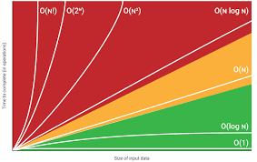

# Big-O Complexity Chart

### `O(n!)` -> N-factorial ====== Permutation using BackTracking
### `O(2^n) -> Exponential-N` ====== For Subsets
### `O(n^2) -> N-Square or Quadratic-N` ====== Nested Loop
### `O(n log n) -> N-log-N` ====== For Sorting
### `O(n) -> O-N` ====== For Traversing Array single(constant time)
### `O(log n) -> O-log-N` ====== For Binary-Search
### `O(1) -> O-1` ====== For very quick time(In single Operation) 